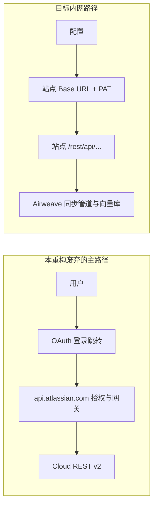

# Confluence 功能重构说明（站点 + Token / 全站可搜）

本文档描述将 Confluence 从 **Atlassian Cloud OAuth + 网关 API** 转向 **企业内网站点 + PAT（或等效 Token）直连 REST** 的重构范围、原则与交付阶段。目标场景为 **mthreads 内网 Wiki 可被 Airweave 检索**；搜索范围策略为 **全站可搜**（在 Token 授权可见范围内）。

### mthreads 联调：站点基址（可入仓）

| 项 | 值 |
|----|-----|
| 站点根 URL | `https://confluence.mthreads.com` |
| REST 示例 | `https://confluence.mthreads.com/rest/api/...` |

**安全（必须遵守）**：Personal Access Token（PAT）**不得**写入本仓库、本文档、Issue 或聊天等可复制传播的位置；**只能**通过本机环境变量（如 `CONFLUENCE_PAT`）、密钥管理系统或 CI 密钥注入使用。若 PAT 曾以明文泄露，须在 Confluence 侧**立即撤销并轮换**。

本机验证示例（**不要把真实 PAT 写进文件**；在 shell 里 `export` 即可）：

```bash
export CONFLUENCE_SITE_URL='https://confluence.mthreads.com'
export CONFLUENCE_PAT='…'   # 仅在本机终端设置，勿提交

curl -sS \
  -H "Authorization: Bearer ${CONFLUENCE_PAT}" \
  -H "Accept: application/json" \
  "${CONFLUENCE_SITE_URL}/rest/api/content?limit=1"
```

更完整的探测可使用：`backend/scripts/confluence_site_pat_smoke.py`（同样只通过环境变量传入 PAT）。

---

## 1. 背景与动机

### 1.1 现状

- 当前 `confluence` 连接器面向 **Confluence Cloud**：
  - 用户走 **OAuth 浏览器授权**（跳转 `auth.atlassian.com`），令牌为 **Atlassian OAuth**（含 refresh）。
  - 业务 API 基址为 **`https://api.atlassian.com/ex/confluence/{cloud_id}`**，使用 **Confluence Cloud REST API v2**（`/wiki/api/v2/...`）。
- 企业 **Data Center / Server / 自建域名**（例如 `https://confluence.example.com`）通常使用 **站点根 URL + Personal Access Token（Bearer）** 调用 **`/rest/api/...`**，与上述路径**不兼容**。

### 1.2 动机

- 内网 Wiki 仅需 **同步并索引页面内容** 即可支撑检索；无需绑定 Atlassian Cloud 产品账号体系。
- 使用 **站点 URL + Token** 可与已有内网权限模型对齐，部署与调试路径更简单。

---

## 2. 目标与非目标

### 2.1 目标

| 项 | 说明 |
|----|------|
| **认证** | 配置 **Confluence 站点根 URL**（如 `https://confluence.mthreads.com`）与 **API Token**（PAT）；请求头 `Authorization: Bearer <token>`（若目标环境要求 Basic，再在实现中扩展）。 |
| **范围** | **全站可搜**：在 Token 可见权限内，覆盖可列举/可检索的页面（通过 CQL 或 REST 列表 + 分页；实现上优先与官方 `/rest/api` 能力对齐）。 |
| **管道** | 页面正文进入现有同步管道（存储 HTML/文本 → 分块 → 嵌入 → 向量库），与现有「可搜」体验一致。 |

### 2.2 非目标（MVP 可不做的）

- 与历史 Confluence **Cloud 连接器**在实体类型上逐项对齐（博客、全量 comment、Database/Folder 等）。
- **Atlassian 网关**、**Cloud ID**、**OAuth refresh 轮换** 作为内网主路径的依赖。
- **增量游标/连续同步**（可后续迭代；MVP 可用定时全量或简单位点）。

---

## 3. 认证策略：去除原有「登录 / OAuth 验证」整套路径

> **本重构的立场**：Confluence 在 **mthreads 内网主线** 上 **不再保留** 原先面向 **Confluence Cloud** 的 **浏览器登录、跳转授权与 Atlassian OAuth2 验链**；避免与 **站点 URL + PAT** 并存时产生误触、双路径维护成本与联调干扰。

**须视为移除或不再接入产品主流程的内容（与「仅隐藏入口」相区别，见实现任务）**：

1. **前端**：Confluence 源上依赖 **「连接 / 去授权 / 跳转到 Atlassian 登录」** 的建连与说明；OAuth 授权返回后的 **claim / verify 浏览器流程**（与 `source-connections` 的 OAuth 回调、`sessionStorage` 中 `oauth_claim_token:*` 等 CLAUDE/AGENTS 所述契约）在 **本 Confluence 内网站点源** 上 **不采用**。
2. **后端 / 集成配置**：`platform/auth/yaml` 中针对 **confluence** 的 **`auth.atlassian.com` / `api.atlassian.com` OAuth 客户端、scope、回调与 rotating refresh** 对 **新内网站点源** 不作为前置条件；**不应**再要求先走 `accessible-resources` 换取 `cloud_id` 才能同步。
3. **运行时**：`TokenProvider` 以 **PAT 或等效长短期令牌 + 显式配置站点 Base URL** 为唯一入口；**不包含** `force_refresh` 换 Atlassian refresh token 的 Cloud 专链逻辑（除非未来单独另立「Cloud 版 Confluence 源」）。

**与「调试期临时关闭」的关系**：历史上可能用 **环境开关** 在适配期先关掉 OAuth；**本目标状态**是 **产品层面不再以登录验证为主路径**——新源默认 **无 OAuth UI、无跳转型授权**，非短期 flag。

**若将来必须同时保留全球 Cloud 版与内网站点版**：应 **两个 `short_name`、两套入口与两套凭据类型**，**禁止**在同一源内混用「站点 PAT」与「点登录去 Atlassian」。

---

## 4. 目标架构（摘要）



- **Base URL**：仅包含 scheme + host（及必要时统一 path 前缀，若前向代理有特殊规则再约定）。
- **全站可搜（索引语义）**：同步任务把 **有权限的页面全文** 拉入 Airweave；**用户检索**发生在 **向量库 / 本侧检索**，**不是** 每次查询实时调 Confluence CQL（与「在线搜索代理」相区别）。`content/search` 等 API 仅用于 **发现 page id 与元数据**。

---

## 5. 全链路：从「拉正文」到「可搜」

**说明用户查询与 Confluence 的关系**：下列流程描述 **一次同步作业**；用户在 UI 的「搜索」**不** 直接请求 Confluence 的搜索接口，而是查 **Airweave 已写入向量目标、经同步管道索引后的数据**。

| 步骤 | 作用 |
|------|------|
| 1. 建连 | `source_connection` 存 **站点 URL + 加密后的 Token**（无 OAuth 跳转）。 |
| 2. 起任务 | Temporal 触发 sync；`SyncFactory._build_source` 创建源实例、`FileService(sync_job_id=…)`、cursor、node_selections。 |
| 3. 流式拉实体 | `AsyncSourceStream` 消费 `source.generate_entities(cursor=…, files=…, node_selections=…)`。 |
| 4. 页面落盘（若有 `FileService`） | 对每页将正文包成 HTML，调用 `files.save_bytes(…)`，供后续读文件、分块。实现参考现有 `ConfluenceSource` 对 Page 的写法。 |
| 5. 管道 | `EntityPipeline`：去重、hash、INSERT/UPDATE 等。 |
| 6. 可搜 | `DestinationHandler`：分块 → 嵌入 → 写入向量库（如 Qdrant/Vespa）；**检索** 走本侧。 |

**要点**：`content/search` / CQL 仅服务 **「枚举有哪些页面要拉」**；**不是** 终端用户「全部搜索体验」的查询引擎。

**代码入口（随重构会新增/调整路径，供对齐）**：

- 流与 `generate_entities` 注入：`backend/airweave/domains/sync_pipeline/factory.py`（`_build_stream`）。
- 现有 Cloud 源示例：`backend/airweave/platform/sources/confluence.py`。

---

## 6. Confluence API 对照

### 6.1 现有实现：Confluence Cloud（`ConfluenceSource`，网关 + OAuth）

先解析 **可访问的 Atlassian 云资源**（**非** 站点 `/rest/api`）：

| 步骤 | 用途 | HTTP（概念） |
|------|------|----------------|
| 解析资源 | 用 OAuth access token 换 `cloud_id` 与 `site_url` | `GET https://api.atlassian.com/oauth/token/accessible-resources` |
| 设 API 基址 | 后续走 Cloud v2 网关 | `https://api.atlassian.com/ex/confluence/{cloud_id}` |

再 **枚举 + 取正文**（**不做** 终端用户查询时的 CQL；采用 **space 列表 → space 下 pages 分页**）：

| 步骤 | 用途 | 路径（接在 `…/ex/confluence/{cloud_id}` 后） |
|------|------|-----------------------------------------------|
| 列空间 | 全部分页 | `GET /wiki/api/v2/spaces?limit=50`（`_links.next` 翻页） |
| 列某空间下页面 | 分页 | `GET /wiki/api/v2/spaces/{space_id}/pages?limit=50` |
| **取页面正文** | storage | `GET /wiki/api/v2/pages/{page_id}?body-format=storage` |
| 评论 / 博客等 | 可选 | 如 `.../inline-comments`、`.../blogposts` 等（主流程以 Page 为主时见源码） |

本重构的 **内网站点** 不采用上述 **accessible-resources + ex/confluence** 链。

### 6.2 目标：自建站点 + PAT（`{site}` = 配置的站点根，如 `https://confluence.mthreads.com`）

**仓库在合并本重构前可尚未实现**；以下为 **Server/Data Center 常见** 模式，**实际参数以你们实例与版本文档为准**。

**A. 发现「要同步的 page」（全站、在 token 可见范围内，二择一或组合）**

| 方式 | 用途 | 示例（概念） |
|------|------|----------------|
| CQL 搜索 | 分页拉齐 page 列表/ID | `GET {site}/rest/api/content/search?cql=type%3Dpage%20...&limit=...&start=...` |
| 空间 + 内容 | 与 Cloud「先 space 再 page」同思路 | `GET {site}/rest/api/space?...` 后 `GET {site}/rest/api/content?spaceKey=...&type=page&...`（字段名以实例为准） |

**B. 取正文（按页 ID 再拉，供落盘与管道）**

| 用途 | 示例（概念） |
|------|----------------|
| 正文 storage / body | `GET {site}/rest/api/content/{id}?expand=body.storage,version,space`（`expand` 以版本支持为准） |

**鉴权**：`Authorization: Bearer <PAT>`（或贵司实例要求的 Basic 等，实现时单源内统一）。

---

## 7. 分阶段交付（建议）

| 阶段 | 内容 | 产出 |
|------|------|------|
| **P0** | 新源 + 凭证模型（`site_url`、`api_token`）；HTTP 直连站点；**从产品中移除 Confluence 的 OAuth/登录建连** | 内网 CQL/单空间可 dry-run |
| **P1** | 全站列表或 CQL 分页、按 id 拉正文、落盘与索引；补充 `body.storage`（XHTML/Storage）轻量后处理（标签降噪、空白归一、宏标记最小清洗） | **全站可搜** MVP + 基础检索质量优化（索引语义见 §5） |
| **P2** | 限流、大页/宏、错误重试、观测 | 可运维性 |
| **P3**（可选） | 增量、附件 | 视需求 |

---

## 8. 运行策略（当前确认版）

为兼顾高频更新与系统成本，内网站点源采用“双轨同步”：

1. **每 10 分钟增量同步**（默认）
   - 目标：处理**新增**与**修改**页面。
   - 发现方式：调用 Confluence 站点 REST 的 `content/search`（CQL）按更新时间窗口筛选 page id，再按 id 拉 `body.storage`。
   - 注意：这里的 **CQL 是 Confluence 官方查询语法**（`/rest/api/content/search?cql=...`），不是 Airweave 内部语法。
2. **每 2 天全量校准**（兜底）
   - 目标：处理漏网变更、权限变更、游标偏差以及删除一致性。
   - 全量任务完成后，以站点当前可见全集对索引进行对账修正。

### 8.1 删除、修改、新增三类变更的处理

| 变更类型 | 增量（10 分钟） | 全量（2 天） |
|------|------|------|
| 新增 | 通过 CQL 命中新页面并入库 | 再次覆盖校验 |
| 修改 | 通过 CQL 命中并重拉正文（按 hash/version 更新） | 再次覆盖校验 |
| 删除 | 优先查询 `GET /rest/api/content?status=trashed&type=page` 做准实时补偿删除 | 做最终一致性删除（差集清理） |

### 8.2 官方 API 边界（基于站点 REST）

- 可用：`GET /rest/api/content?status=trashed&type=page`（可分页、可加 `spaceKey`）用于回收站内容发现。
- 谨慎：很多 Server/DC 版本里，`content/search` 的 CQL 不支持 `status=trashed` 条件（会返回 400）。
- 结论：**删除路径不要只依赖 CQL**，应将 `status=trashed` 列举与全量校准共同作为删除保障机制。

### 8.3 实现约束：预留扩展接口，避免写死

为确保后续可平滑升级到“双计划策略”（10 分钟增量 + 2 天全量）及更多同步模式，本次适配必须遵循以下约束：

1. **调度能力不可写死在 Confluence 源内部**
   - 不在 source 代码里硬编码“固定 10 分钟”或“固定 2 天”常量。
   - 调度节奏由 `schedule` 配置或调度层（Temporal schedule service）驱动。
2. **发现策略抽象为可替换接口**
   - 将“增量发现（CQL/search）”“回收站发现（status=trashed）”“全量枚举”拆分为独立方法/策略函数。
   - 允许按站点版本能力切换（例如某些版本不支持 CQL `status`）。
3. **删除处理走统一入口**
   - 删除判定与发出删除实体（orphan/trashed）使用统一逻辑层，避免在多个调用路径分叉实现。
4. **为未来双计划提供数据结构预留**
   - 当前即使只接一个 `schedule.cron`，也要在实现上保留 secondary/companion schedule 扩展点（如全量校准 companion 任务）。
   - 避免把“增量=唯一计划”假设写进持久化模型和业务分支。
5. **能力探测与降级明确**
   - 对关键 API 能力（`content/search`、`status=trashed`、`expand=body.storage`）做探测与日志标记。
   - 能力不足时走降级路径（space/content 枚举、全量校准兜底），而非直接失败。

> 实施原则：先交付可用最小闭环（URL+PAT+可搜），同时把“可扩展调度与策略切换”作为代码结构约束一次性打好地基。

### 8.4 联调示例：`PATCH /source-connections/{id}` 调度配置

以下示例用于验证前后端调度链路（UI 或 API 直调均可）。其中：

- `BASE_URL`：Airweave API 地址
- `SC_ID`：source_connection 的 UUID
- `TOKEN`：用户访问令牌（非 Confluence PAT）
- `ORG_ID`：组织 ID（如需）

#### 1) 关闭计划（one-time）

```bash
curl -X PATCH "$BASE_URL/source-connections/$SC_ID" \
  -H "Content-Type: application/json" \
  -H "Authorization: Bearer $TOKEN" \
  -H "X-Organization-ID: $ORG_ID" \
  -d '{
    "schedule": null
  }'
```

#### 2) 每日定时（无 companion）

```bash
curl -X PATCH "$BASE_URL/source-connections/$SC_ID" \
  -H "Content-Type: application/json" \
  -H "Authorization: Bearer $TOKEN" \
  -H "X-Organization-ID: $ORG_ID" \
  -d '{
    "schedule": {
      "cron": "0 2 * * *"
    }
  }'
```

#### 3) 每 10 分钟增量 + 每 2 天全量校准（推荐）

```bash
curl -X PATCH "$BASE_URL/source-connections/$SC_ID" \
  -H "Content-Type: application/json" \
  -H "Authorization: Bearer $TOKEN" \
  -H "X-Organization-ID: $ORG_ID" \
  -d '{
    "schedule": {
      "cron": "*/10 * * * *",
      "companion_full_sync": {
        "interval_days": 2
      }
    }
  }'
```

#### 4) 每 10 分钟增量 + 指定 companion cron（覆盖 interval_days）

```bash
curl -X PATCH "$BASE_URL/source-connections/$SC_ID" \
  -H "Content-Type: application/json" \
  -H "Authorization: Bearer $TOKEN" \
  -H "X-Organization-ID: $ORG_ID" \
  -d '{
    "schedule": {
      "cron": "*/10 * * * *",
      "companion_full_sync": {
        "cron": "15 3 */2 * *"
      }
    }
  }'
```

#### 5) 执行后核对项

1. API 响应中的 `schedule.cron` 已更新为目标值。
2. 对分钟级 cron，后端日志出现 minute schedule 与 companion cleanup/full schedule 的创建或更新记录。
3. 下一个周期触发后，`sync_job` 中可观察到增量任务执行；在 companion 周期触发时可观察到 full 清理任务执行。

---

## 9. 主要风险与依赖

- **Confluence 版本差异**：DC/Server 的 REST 行为、分页参数需以目标实例为准。
- **权限**：PAT 仅能索引用其 **可见** 页面；**全站** = 该令牌的可见全集，非匿名全库。
- **安全**：PAT 按组织级密钥与轮换管理，**禁止**入仓与日志明文。
- **正文格式与检索质量**：`body.storage` 多为 XHTML/Storage（非 Markdown）；若不做最小后处理，宏标签/样式噪声可能影响分块与召回质量。建议在 P1 增加单测锁定正文格式契约（`representation` / `value`）并验证后处理后的可检索文本质量。

---

## 10. 相关代码位置（便于联调定位）

以下随重构会迁移或废弃部分路径，仅作入口参考：

- 连接器：`backend/airweave/platform/sources/confluence.py`（Cloud 现状；**新内网站点源** 应另文件或明分支）
- 实体：可复用或裁剪 `backend/airweave/platform/entities/confluence.py`
- 配置：`backend/airweave/platform/configs/config.py`、`backend/airweave/platform/configs/auth.py`
- **待下线或仅限旧 Cloud 源**：`backend/airweave/platform/auth/yaml/*.integrations.yaml` 中 **confluence** OAuth、`domains/oauth` 中与 Confluence Cloud 建连/回调/verify 的耦合
- 前端：source 选择、`SourceAuthenticationView` 等中的 **Confluence 登录 / OAuth 分支**（**内网站点源** 不保留跳转型授权 UI）

---

## 11. 文档维护

- 新 `short_name`、环境变量与凭据字段确定后，更新 §6、§9。
- 若将来恢复「Cloud 版 Confluence」为第二源，另起章节说明与 **内网站点源** 的隔离，避免再引入「登录验证」与 PAT 混源。

---

## 12. 变更记录

| 日期 | 说明 |
|------|------|
| 2026-04-23 | 初稿：全站可搜、站点 + Token 方向；重构期对 OAuth 的处置说明 |
| 2026-04-23 | 明确 **去除原有登录 / OAuth 验证主路径**；补充 §5 全链路与 §6 API 对照（Cloud / 站点） |
| 2026-04-24 | 删除 Confluence MCP 网关/代理方案表述；检索路径统一为 **Confluence → Airweave 同步管道 → 本侧向量检索** |
| 2026-04-24 | 补充 mthreads 联调站点 URL；明确 PAT **禁止**入仓，仅环境变量 / 密钥系统 |
| 2026-04-24 | 在 P1 中补充 `body.storage`（XHTML/Storage）后处理与正文格式单测建议，降低分块检索噪声风险 |
| 2026-04-25 | 新增运行策略：**10 分钟增量 + 2 天全量校准**；明确删除链路使用 `status=trashed` 查询与全量兜底 |
| 2026-04-25 | 新增实现约束：适配阶段需预留扩展接口、避免将调度策略写死在 Confluence 源实现中 |
| 2026-04-25 | 补充调度联调示例：`PATCH /source-connections/{id}` 的 4 类请求样例与执行后核对项 |
